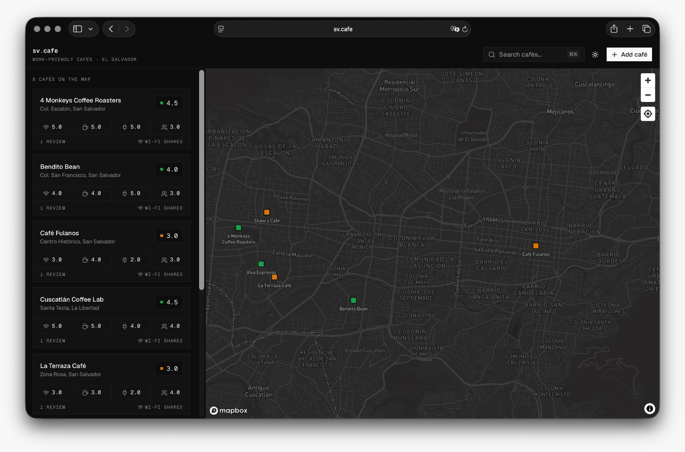

# sv.cafe ☕

```text
       ) )
      ( (
       ) )
   .----------.
   |          |---.
   |          |   |     sv.cafe
   |          |---'     work-friendly cafés in El Salvador
    \        /
     '------'           $ rate --wifi --pass-reveal ─> on the map
   ____________
```

Community map of work-friendly cafés in El Salvador. Every café is rated on
four dimensions: **Wi-Fi**, **Coffee**, **Outlets** (easy to plug a charger)
and **Meetings** (calls and meetups friendly). Each café also shares its
Wi-Fi network name with a tap-to-reveal password.



## Stack

- **Next.js 16** (App Router, server actions) + Tailwind v4
- **shadcn/ui** components with a midday-inspired monochrome theme (zero radius,
  flat borders, mono-font labels, dark mode via next-themes)
- **Drizzle ORM** over **Neon** Postgres (`@neondatabase/serverless`)
- **Zod v4** validation + `@t3-oss/env-nextjs` typed env. All types derived
  from the schema (`$inferSelect`, `z.infer`), no hand-written interfaces
- **Mapbox GL** for the map
- **Upstash Redis** rate limiting on the write paths

## Run it

```bash
bun install
bun run db:seed   # idempotent, seeds 8 San Salvador cafés
bun dev
```

Needs `.env.local` with `DATABASE_URL` (Neon) and `NEXT_PUBLIC_MAPBOX_TOKEN`.
Optional: `UPSTASH_REDIS_REST_URL` + `UPSTASH_REDIS_REST_TOKEN` (rate limits
are skipped when absent).

## How it's wired

- `lib/ratings.ts` is the single source of truth for rating dimensions; UI,
  forms and validation derive from it.
- `db/schema.ts` holds `cafes` + `reviews`; `db/queries.ts` computes
  per-dimension averages in SQL.
- `app/actions.ts` contains zod-validated server actions (`createReview`,
  `createCafe`) with `revalidatePath` and per-device rate limits.
- Anonymous identity: an httpOnly device cookie with a client fingerprint as
  recovery fallback. One review per device per café, resubmitting edits yours.
- `/` is a drawer-first explorer: map + list + ⌘K command palette. Selecting a
  café (list, pin, or ⌘K) opens an instant drawer (bottom sheet on mobile,
  floating right sheet on desktop). All data ships upfront, zero fetches.
- `/cafes/[slug]` is the deep-link page reusing the same details component;
  `/cafes/new` adds a café (with a geolocation helper).
- `bun run assets:generate` rebuilds the ASCII-themed OG images and favicon.
